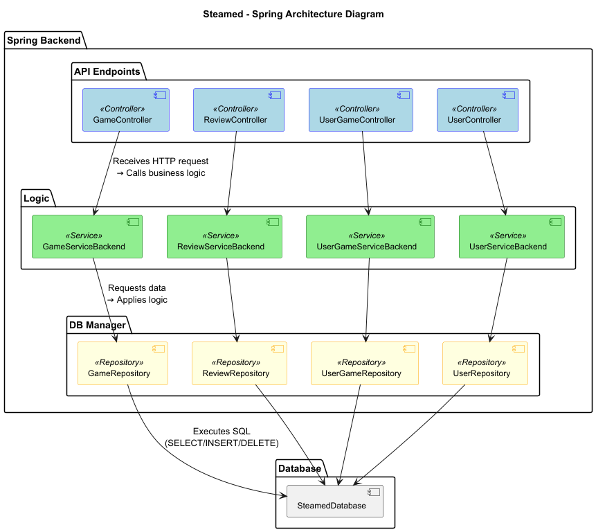
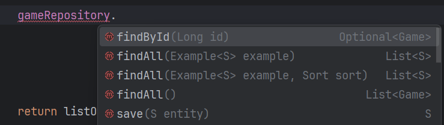

# How to use
There are many different ways to use Java Spring Boot which cannot all be explained in this document. However the most common way to use it is as a Backend for a Website. Spring Boot makes it really easy to setup a Backend for connecting frontend and backend.

For that it uses a layered Architecture internally, consisting of:
- **Controllers**
- **Services**
- **Repositories**
- **Entities** (and often **DTOs** + **Mappers**)



## Entities

First we need to talk about Entities. They are representing our Database Tables in our Backend. 

Defining these Entities tells Spring -> Jpa -> and then in the end Hibernate how to ***Generate*** the database Tables for us. This means we dont even need to write a create script for the Database. Spring handles that for us.

```Java
package com.ESD.steamed.game;

import com.ESD.steamed.userGame.UserGame;
import com.ESD.steamed.review.Review;
import jakarta.persistence.*;
import lombok.Data;
import java.math.BigDecimal;
import java.time.LocalDate;
import java.util.ArrayList;
import java.util.List;

/* Explanation: This class represents the "game" table in the database.Each field becomes a column. @Id + @GeneratedValue means auto-incrementing primary key. @OneToMany sets up relationships — one game has many reviews and library entries. When Spring boots up, Hibernate creates the table automatically from this entity. */

@Entity
@Data
@Table()
public class Game {

    @Id
    @GeneratedValue(strategy = GenerationType.IDENTITY)
    private Long id;

    @Column(nullable = false, length = 100)
    private String title;

    @Column(columnDefinition = "TEXT")
    private String description;

    @Column(nullable = false, precision = 10, scale = 2)
    private BigDecimal price;

    private LocalDate releaseDate;

    @Column(length = 100)
    private String developer;

    @OneToMany(mappedBy = "game", cascade = CascadeType.ALL, orphanRemoval = true)
    private List<Review> reviews = new ArrayList<>();

    @OneToMany(mappedBy = "game", cascade = CascadeType.ALL, orphanRemoval = true)
    private List<UserGame> libraryEntries = new ArrayList<>();

    
}

```

## Controller

A controller contains the Endpoints of the Backend which are exposed to the outside world. For this example it is shown based on a REST (Representational State Transfer) API.


``` Java
package com.ESD.steamed.game;

import lombok.Data;
import org.springframework.beans.factory.annotation.Autowired;
import org.springframework.http.HttpStatus;
import org.springframework.http.ResponseEntity;
import org.springframework.web.bind.annotation.GetMapping;
import org.springframework.web.bind.annotation.RequestMapping;
import org.springframework.web.bind.annotation.RestController;

import java.util.List;

@RestController
@RequestMapping("/game")
public class GameController {
    
    private GameService gameService;

    public GameController(GameService gameService) {
        this.gameService = gameService;
    }

    @GetMapping
    public ResponseEntity<List<GameDTO>> getAll(){
       return ResponseEntity.ok(gameService.getAll());
       
       /* Explanation: This endpoint handles GET requests to /game.It calls the service, wraps the result in a ResponseEntity (Class for creating HTTP Responses), and sends it back as JSON.Spring automatically converts the List<GameDTO> into proper HTTP response with status code. */
    }
}


```

This GameController is like the front door of your backend. It will listen to any HTTP requests coming in from outside with the specification ```/game```.
To give an example: ```localhost:8080/game```

This is done by this line:

```Java
@RequestMapping("/game") 
```

Within the controller the ```@GetMapping``` Defines a method ```getAll()```which will be executed if the incoming request to ```/game``` is a GET request.

To keep it simple we will ignore the rest of this code and move to the service that is now called with ```gameService.getAll()``` This Service has been injected into the Controller using the constructor. Under the hood Spring manages this dependency automatically.

----

## Services

Services are the brain of your Backend. This is where any logic such as making several requests to the Database are initiated, where objects are build to be send back to the Client and where any computations are happening.

```Java
package com.ESD.steamed.game;

import org.springframework.stereotype.Service;
import lombok.AllArgsConstructor;
import java.util.List;

@Service
@AllArgsConstructor
public class GameService {
    private final GameRepository gameRepository;

    public List<GameDTO> getAll(){
        List <Game> listOfGames = gameRepository.findAll();
        return gameMapper.toDtoList(listOfGames);
        /* Explanation: This method asks the repository for all games and returns them.
       Right now it's simple, but this is where business logic lives — like filtering, sorting, or combining data.
       When we call gameService.getAll(), Spring runs the repository's findAll() under the hood. */
    }
}

```

As before with the Service that has been injected to the Controller, now the Gamerepository has been injected to the service. In this example the Code is very simple and does not do much except for calling the repository and returning its result. (We will se a more complex example later.)

## Repositories


Lets now move to what the repository does. Well... there is not a lot of code in here.

```Java
package com.ESD.steamed.game;

import org.springframework.data.jpa.repository.JpaRepository;
import org.springframework.stereotype.Repository;

@Repository
public interface GameRepository extends JpaRepository<Game, Long> {
    // There is no code because there is no code needed here! Spring Data JPA gives us findAll(), save(), deleteById() etc. for free.
    // <-- Explanation: This interface connects directly to the database.
    // It knows how to talk to the "games" table because it’s linked to the Game entity.
    // When we call gameRepository.findAll(), Spring magically runs: SELECT * FROM game;
}
```

Because this GameRepository extends the JpaRepository using our ```Game``` Entity as the type here: ```JpaRepository<Game, Long>``` under the hood Spring manages every basic operation a Database table might need. This means we can call the following methods without having to write them:




<!-- 

```Java
package com.ESD.steamed.game;

import lombok.Data;
import java.math.BigDecimal;
import java.time.LocalDate;

@Data
public class GameDTO {
    private Long id;
    private String title;
    private String description;
    private BigDecimal price;
    private LocalDate releaseDate;
    private String developer;
    // <-- Explanation: placeholder
}
```

```Java
package com.ESD.steamed.game;

import org.springframework.stereotype.Component;

@Component
public class GameMapper {

    public GameDTO toDto(Game game) {
        GameDTO dto = new GameDTO();
        dto.setId(game.getId());
        dto.setTitle(game.getTitle());
        dto.setDescription(game.getDescription());
        dto.setPrice(game.getPrice());
        dto.setReleaseDate(game.getReleaseDate());
        dto.setDeveloper(game.getDeveloper());
        return dto; 
    }
}
``` -->
