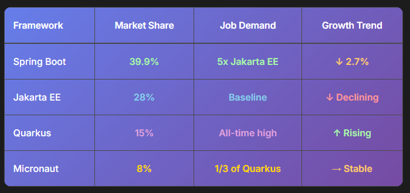
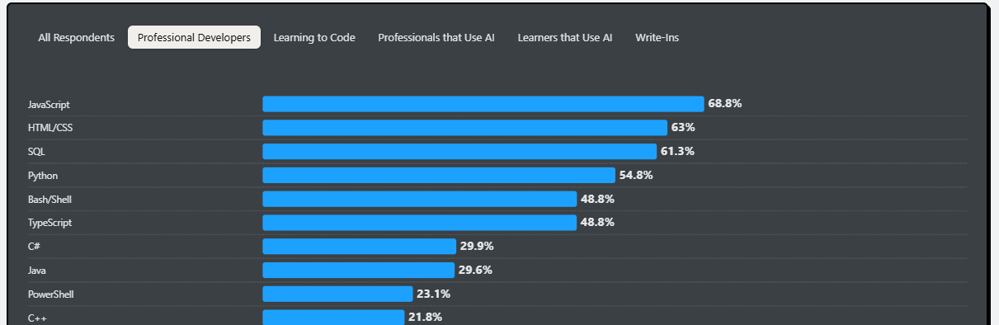

# Relevance

Java Spring Boot is widely used across some of the biggest tech companies in the world. Some of them Include:

- Netflix
- Amazon
- Paypal
- Ebay
- Capgemini
- Mastercard
- CGI

Its dominance on the Java Framework market:

Source: (TMS Outsource (n.d.))

In the figure above it can be seen that Spring Boot is the leader of all current Java Frameworks with a market Share of 40%. Considering the following graph from the developer survey made by (Stack Overflow (2025)) it can be seen that Java is a very popular and often used language among professional developers. Assuming that most developers are unlikely to not use a framework at all it is also underlining the dominance of SpringBoot in the overall language market.

Source: (Stack Overflow (2025))

## Why it is so relevant

The reason Spring Boot is so popular amongst these tech giants is because of several reasons:

### Spring Boots support for microservices.
Microservices really become interesting for large scale applications with large amounts of request and traffic (Spring.io, n.d.; CGI, 2019) Large Scale application almost always benefit from having a decoupled Microservices Architecture.

### Scalability and easy of development and deployment.
Spring Boot makes deployment, wiring of different components, and configuration a lot easier by handling most of the work in the background.(HiQ, n.d.; CodingCops, n.d.). This leaves more time for developers to focus on the important non trivial tasks.

### The Huge and active eco-system around the framework
They can leverage a lot of already existing Spring functionalities such as Spring Security, secure REST API, Kafka integration, consuming of cloud Services. (HiQ, n.d., Spring.io, n.d.).
This speeds up developmend time and make integrating new features and systems way faster and esier. (HiQ, n.d.) Especially in Large companies where a lot of developer might be working on a project, having a out of the box solution that is well documented and tested is way saver and easier to use. (CodingCops, n.d.)

### Spring Boot has been proven to work
Large companies cannot take a when choosing a platform to develop with. It has to be proven to work and to work consistently, scalable and reliable.

References

CGI (2019) Breaking the Monolith: Application Whitepaper. Available at: https://www.cgi.com/sites/default/files/2019-12/breaking-the-monolith-application-whitepaper-en.pdf
 (Accessed: 13 November 2025).

HiQ (n.d.) Spring Boot, Quarkus or Micronaut? Your Guide Through the Java Framework Jungle. Available at: https://hiq.se/en/insight/spring-boot-quarkus-or-micronaut-your-guide-through-the-java-framework-jungle/
 (Accessed: 13 November 2025).

CodingCops (January 15, 2025) Spring Boot Success Stories: Real-World Applications & Impact. Available at: https://codingcops.com/spring-boot-success-stories
 (Accessed: 13 November 2025).

Spring.io (n.d.) Spring Microservices. Available at: https://spring.io/microservices
 (Accessed: 13 November 2025).

TheirStack (n.d.) Technology Stack: Spring Boot. Available at: https://theirstack.com/en/technology/spring-boot
 (Accessed: 13 November 2025).

TMS Outsource (August 13, 2025) Java Statistics: Usage and Market Share. Available at: https://tms-outsource.com/blog/posts/java-statistics/
 (Accessed: 13 November 2025).

Stack Overflow (2025) Developer Survey 2025. Available at: https://survey.stackoverflow.co/2025/technology
 (Accessed: 13 November 2025).

TIobe (n.d.) TIOBE Index: Programming Language Popularity. Available at: https://www.tiobe.com/tiobe-index/
 (Accessed: 13 November 2025).

---

Other Info / References

1. Java is used by 90 percent of the fortune 500 companies, with Spring Boot taking up 40 percent of the market share inside of Java (<https://tms-outsource.com/blog/posts/java-statistics/>)
2. 16% of professional developers have either used spring boot in the last year, and/or intent to use it in the coming year. <https://survey.stackoverflow.co/2025/technology>
3. Programming language overall usage: <https://www.tiobe.com/tiobe-index/>