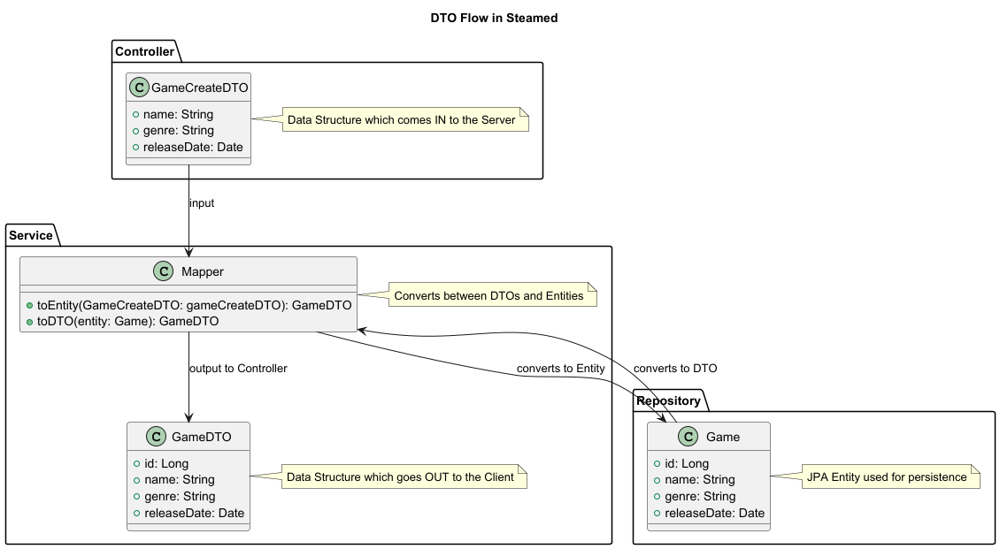

# Challenge

The Database Schema:

()[]


## Review
fields:
- private Long id;
- private String title;
- private Long rating;
- private String comment;
- private LocalTime created_at;

Constraints:
The title can only be 100 Characters long.
The rating has to be from 1-3 (1 = Bad, 2 = Okay, 3 = Good) (Could have also been solved with an enum but is nice for the challenge)


- 0-10 min: Introduction, project setup explanation (entities, repos, 1 basic controller), explain how tests work.

- 10-35 min: Challenge 1: Build Publisher CRUD (with tests). Students work to make PublisherChallengeTest.java pass.

- 45-55 min: Challenge 2: Quiz on existing data using the API. Give them 2-3 questions about the pre-populated data (including the new publishers and games linked to them) that require them to make API calls to find answers.

- 55-60+ min: Solution walkthrough for the quiz, general Q&A, next steps/resources.


## The assignment:
This Spring Boot Application is the backend for a Game Website in which you can buy and review games. 
You might be familiar with some platform sounding pretty similar to "Steamed" ;) . 
Most of your work will be done creating the functionality for Games. As of now there is only a half baked version
of the Game module present which you have to fix and extend. 

Within the [test folder](src/test/java/com/ESD/steamed) you can see test for all the different Endpoints. The Goal 
is to get every test green within this Folder. 

I hope it is not overwhelming and most of it is clear. If you have any questions DO NOT HESITATE to ask Joost or Florian.
However, Florian created this messy demo project so if you get lost you should ask the Expert of this Chaos.

I tried my best to make something that is quite hard but doable for people with prior knowledge to give them a challenge
while also trying to start at a point where complete beginners can follow. Don't feel discouraged by the amount of work!
You can either take it slow and really try to understand everything and to learn Spring, or try to rush through it 
to finish the Challenge it is your choice! :) . 

[HOW TO USE SPRING CLICK HERE!](https://github.com/FontysVenlo/esd-workshop-spring-boot-hibernate/blob/main/Research/spring/how_to_use.md)

# Part 1 Controllers & DTOs

1. First get a quick overview over the project. Read the comments and use other Models as reference on how to implement 
things. If you dont remember a concept you can always have a look at our Guide: 
2. Start with fixing the [GameController](src/main/java/com/ESD/steamed/game/GameController.java) a lot of stuff is missing here. Hint: Think about Annotations and services.

* Now your [GameController](src/main/java/com/ESD/steamed/game/GameController.java) class should at least not complain about missing references and should be ready to handle incoming
HTTP requests.

***Solution***:
```Java
private final GameService gameService;

    public GameController(GameService gameService) {
        this.gameService = gameService;
    }
```

```Java
@RestController
@RequestMapping("/games")
```

3. Okay the next thing we have to repair is the broken ```getAll()``` method in [GameController](src/main/java/com/ESD/steamed/game/GameController.java)
. This method is supposed to return all wonderful Games that our Platform Steamed has to offer.
If we look at our [GameService.java](src/main/java/com/ESD/steamed/game/GameService.java) class we can see that 
there is already an implemented method ```getAll()``` for that purpose. We just have to make sure we call this method
in our Controller, and return it using ```ResponseEntity.ok()```. ```ResponseEntity.ok()``` Will return a HTTP status
of 200 meaning that the request was successful.

***Great!*** now our Controller knows how to get all of our Beautiful games.

Before we can test this method we have to make sure our Controller is able to ***Add*** new games first. If the author
of this Workshop had done a good Job writing the tests this interdependency could have been avoided, however nobody 
is perfect :)

***Solution***:

```Java
@GetMapping
public ResponseEntity<List<GameDTO>> getAll(){
return ResponseEntity.ok(gameService.getAll());
}
```

4. So let's do it then! Create a method called ```create()``` within [GameController](src/main/java/com/ESD/steamed/game/GameController.java)
remember that this method needs to ***CREATE*** something in our Database, so you have to make sure to use the correct
REST Operation Annotation. in the parameter of ```create()``` you will need to put the Datatype that you expect from the 
client side. The correct HttpStatus is ```CREATED``` because the method will CREATE a Game for us! The body of the ResponseEntity will be our newly created ```GameDTO```.


<details>
<summary>How DTOs work</summary>

However: Before we can finally test our two methods now, we need to talk about DTOs (Data Transfer Objects) this is
something NOT SPECIFIC TO SPRING however it is almost always used when creating REST APIS and a standard in the
industry. So when we are talking about ***Enterprise Software Development*** we cannot miss it.

DTOs are there to make sure that you have ***complete control*** over the shape of your data in each part of your 
application. There are many different reasons to use them but the one that made it click for me is ***security***. In our project
we have a User Table containg ```Email```, ```Username``` and ```password```. So far so good. If we get this User ```Entity``` and return it as is,
we would actually expose our (hopefully hashed) ```password``` to the outside world.

To make sure this does not happen we can create a ```UserDTO``` which only contains ```Email``` and ```Username```. And there you go! no exposure of sensitive data. This approach can also be taken for other reasons as explained in the next paragraph. But first a dancing cat to get your attention back on track. 

<details>
<summary>Click me :)</summary>


</details>

---

Below you see a diagram showing where each "type" of dto lives. The exact approach is the one I prefered / came up with and there is no right or wrong but simply based on preference. Any incoming request to the backend will be in the shape of an (EntityName)+CreateDTO. For this example lets use our ```Game entity```. In our ```GameCreateDTO``` we dont need to send an id because that id will be generated for us within the database. Makes sense right? So we will just leave it out in the CreateDTO. CreateDTOs are DTOs from which you create new objects / database entries. They only contain relevant data for that purpose.

When we get a Game object from our database it comes in the form of an ```Entity```. Next to the reason of not wanting to expose sensitive data it could also be the case that you want to have a ***calculated value*** from two different tables or you want to have ***exact controll*** what you want to return to the Client. 

Transformting these objects from ```CreateDTO``` to ```Entity``` from ``Entity`` To ```DTO``` and so on is the job of a ```Mapper``` class.

And that is basically it. Have a look at the diagram below and move forward once you get the general idea. You wont have to do any mapping yourself you can always use the preexisting mapper classes for that. 



</details>


***Solution***

```Java
@PostMapping
public ResponseEntity<GameDTO> create(@RequestBody GameCreateDTO gameCreateDTO){
return ResponseEntity.status(HttpStatus.CREATED).body(gameService.create(gameCreateDTO));
}
```
Okay that was quite alot. Lets see if everything works by running the ``testCreateGame()`` ``testCreateGame()`` method in our [GameControllerTest.java](src/test/java/com/ESD/steamed/GameControllerTest.java) and ``testGetAllGames()``.

If the Test ran successfully **Congratulations!** you have reached the first Checkpoint! 

# Part 2 Services

Up until now we have only worked within our Controller 

1. 


